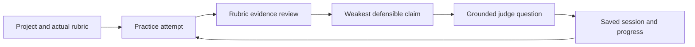

# Lancar

Lancar is a private rehearsal workspace for Indonesian students preparing a rubric-driven
pitch, scholarship interview, thesis defense, or competition Q&A.

It is designed as software a student returns to throughout preparation—not as a landing
page or scripted product demo. A user keeps separate projects, maintains the real
evaluator rubric, practices an attempt, answers one grounded judge question, saves the
session, and tracks which claims remain weak across attempts.

## Run the product

Requirements: Node.js 20 or newer and pnpm.

```bash
pnpm dev
```

Open `http://127.0.0.1:4173`. The included workspace contains an active hackathon project
and two prior sessions so the returning-user experience is immediately inspectable.

From the workspace you can:

1. continue the current project or create another one;
2. edit the evaluator criteria and evidence cues for each project;
3. paste or dictate a practice attempt;
4. inspect criterion-level transcript evidence and the weakest claim;
5. rehearse the judge question generated from that exact weakness;
6. save the attempt and review the evidence trend in Progress;
7. reload the browser without losing projects, drafts, rubrics, or session history.

All workspace data is stored in browser `localStorage`. Dictation uses the browser's speech
recognition capability when available; Lancar does not record or persist raw audio.

## Product loop



The current analyzer is transparent deterministic cue matching. It measures how explicitly
the declared rubric evidence appears in a transcript. It does not claim to measure
confidence, talent, truth, or general speaking ability. Production semantic analysis must
retain rubric and transcript citations plus explicit uncertainty.

## Repository commands

```bash
pnpm dev          # start the local product at 127.0.0.1:4173
pnpm test         # domain, agent CLI, and HTTP boundary tests
pnpm test:browser # full product workflow and responsive browser gate
pnpm check        # complete repository gate
pnpm project      # compact TOON repository context for coding agents
```

The rendered-browser gate verifies the workspace, accessible fields, project persistence,
practice setup, rubric-grounded review, Q&A defense, session history, project creation,
rubric editing, reload persistence, and mobile layout.

## Current boundary

This is a dependency-free, device-local product prototype. It has a real recurring workflow
and persistent data, but it does not yet have accounts, cloud sync, document upload,
production transcription, or a semantic model. Those are implementation boundaries—not
reasons to present the product as a mockup.

Body-language scoring, streaks, generic speaking scenarios, and institutional dashboards
remain outside the product until the rubric → evidence → defend loop is validated with
students using their own materials.

## Private Vercel deployment

Production deployment is protected by `middleware.js` using HTTP Basic Authentication.
Set `SITE_PASSWORD` in Vercel for every deployed environment; the middleware fails closed
with a `503` if the secret is absent. The username is `lancar`. Never commit the password
to this repository or place it in client-side JavaScript.

The decision brief is in [docs/FEASIBILITY.md](docs/FEASIBILITY.md), and the product contract
is in [docs/specs/2026-08-06-lancar-mvp.md](docs/specs/2026-08-06-lancar-mvp.md).

## Agent harness

The repository was scaffolded from
[`dafandikri/agent-harness`](https://github.com/dafandikri/agent-harness) 0.1.0.
`AGENTS.md` is the model-agnostic source of truth, while durable product decisions live in
`.agent-harness/memory/`.

Before using AI-generated implementation during the official hacking period, ask the
organizer for written confirmation: the guidebook allows responsible tools and APIs but
also prohibits outside professional assistance and outsourced code.
