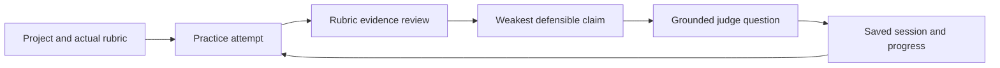

# Talk-Active

Talk-Active is a private rehearsal workspace for Indonesian students preparing a rubric-driven
pitch, scholarship interview, thesis defense, or competition Q&A.

It is designed as software a student returns to throughout preparation—not as a landing
page or scripted product demo. A user keeps separate projects, maintains the real
evaluator rubric, practices an attempt, answers one grounded judge question, saves the
session, and tracks which claims remain weak across attempts.

Deployed at **<https://talk-active-id.vercel.app>**. Semantic analysis runs through the AI
Gateway and degrades visibly to deterministic cue matching when the gateway is unavailable, so
the product keeps working and says which engine produced each verdict.

## Run the product

Requirements: Node.js 20 or newer and pnpm.

```bash
pnpm dev
```

Open `http://127.0.0.1:4173`. The included workspace contains an active hackathon project
and two prior sessions so the returning-user experience is immediately inspectable.

From the workspace you can:

1. continue the current project or create another one;
2. edit the evaluator criteria and evidence cues for each project;
3. paste or dictate a practice attempt;
4. inspect criterion-level transcript evidence and the weakest claim;
5. rehearse the judge question generated from that exact weakness;
6. save the attempt and review the evidence trend in Progress;
7. reload the browser without losing projects, drafts, rubrics, or session history.

Guest workspace data is stored in browser `localStorage`. Dictation uses the browser's speech
recognition capability when available. Multimodal rehearsal can create a camera-and-microphone
replay only after explicit opt-in; guest replay stays in the current page, while a configured,
signed-in deployment can save it privately for later timestamp review.

## Product loop



Every analysis starts with transparent deterministic cue matching so the product always has a
usable answer. When the server has an AI Gateway credential, the frontend posts the transcript
and rubric to `/api/analyze`; a language model proposes criterion evidence, and server code
rejects any supporting quote that cannot be found in the transcript. The interface identifies
which engine answered each criterion. A timeout, malformed response, exhausted budget, or lost
network visibly degrades to the deterministic result instead of breaking the rehearsal.

The result measures explicit rubric evidence in one transcript. It does not claim to measure
confidence, talent, truth, or general speaking ability.

## Test semantic analysis locally

The local server runs the same `/api/analyze` and `/api/import-rubric` handlers as Vercel.
Pull the Development environment once, then start normally:

```bash
vercel env pull .env.local --environment=development --yes
pnpm dev
```

Open `http://127.0.0.1:4173`, start a practice attempt, and select **Review this attempt**.
With a working Gateway response, the review says “Evidence mapped by a language model, then
checked against your transcript.” Without a credential or network, it says “Evidence mapped by
cue matching on this device.” Both paths complete the same evidence → question → saved-progress
loop. Never commit `.env.local` or paste its value into browser code.

## Repository commands

```bash
pnpm dev          # start the local product at 127.0.0.1:4173
pnpm test         # domain, agent CLI, and HTTP boundary tests
pnpm test:browser # full product workflow and responsive browser gate
pnpm check        # complete repository gate
pnpm project      # compact TOON repository context for coding agents
```

The rendered-browser gate verifies the workspace, accessible fields, project persistence,
practice setup, rubric-grounded review, Q&A defense, session history, project creation,
rubric editing, reload persistence, and mobile layout.

## Current boundary

The default guest path stays device-local with server-assisted semantic mapping. The Next.js
deployment can additionally enable accounts, Postgres sync, private source files, and opt-in
private attempt replay when their services are configured. Browser dictation remains vendor-
dependent, and saved replay is never required for transcript or rubric analysis.

Body-language scoring, streaks, generic speaking scenarios, and institutional dashboards
remain outside the product until the rubric → evidence → defend loop is validated with
students using their own materials.

## Vercel deployment

The exhibition deployment is public by default so judges and QR visitors can use it without an
account. `middleware.js` can still protect an internal deployment when
`PRIVATE_DEPLOYMENT=1` and `SITE_PASSWORD` are both configured; if privacy is requested without
a password, it fails closed with `503`. Never commit a password, Gateway credential, or Vercel
token, and never place one in client-side JavaScript.

The decision brief is in [docs/FEASIBILITY.md](docs/FEASIBILITY.md), and the product contract
is in [docs/specs/2026-08-06-talk-active-mvp.md](docs/specs/2026-08-06-talk-active-mvp.md).

## Agent harness

The repository was scaffolded from
[`dafandikri/agent-harness`](https://github.com/dafandikri/agent-harness) 0.1.0.
`AGENTS.md` is the model-agnostic source of truth, while durable product decisions live in
`.agent-harness/memory/`.

The executable agent contract is documented in
[`docs/AGENT-WORKFLOW.md`](docs/AGENT-WORKFLOW.md). The repository ships the
`captains-workflow` skill, model adapters that point back to `AGENTS.md`, a local pre-push
gate, and the same `pnpm check` gate in CI. `test/harness-integration.test.mjs` prevents those
links from drifting into documentation-only promises.

Before using AI-generated implementation during the official hacking period, ask the
organizer for written confirmation: the guidebook allows responsible tools and APIs but
also prohibits outside professional assistance and outsourced code.
