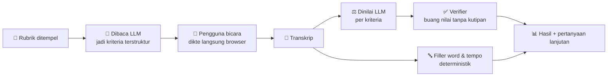
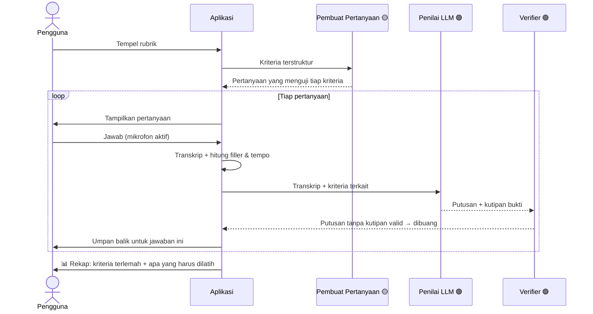
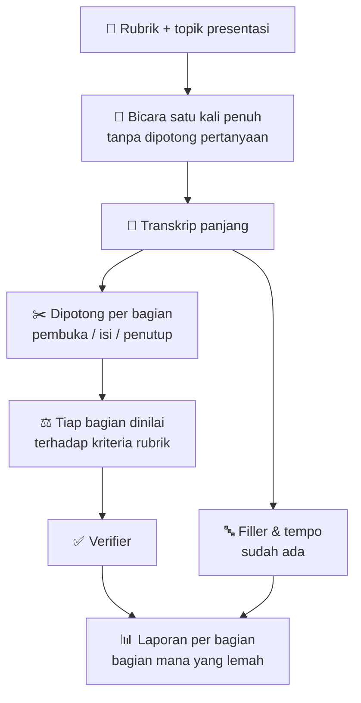
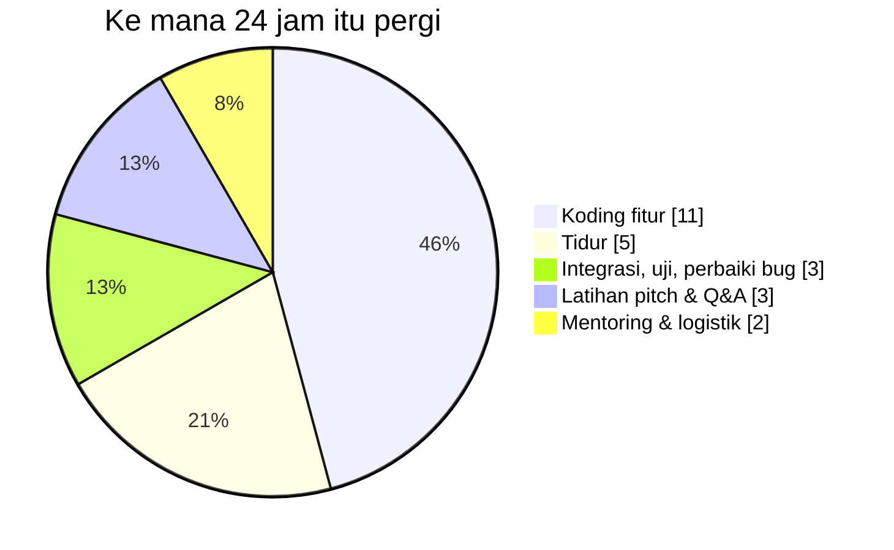

# Talk-Active — Dua Mode Latihan
## Versi yang Muat dalam 24 Jam

> Dokumen ini punya satu tujuan: memisahkan **apa yang benar-benar dibangun dalam
> 24 jam** dari **apa yang diceritakan sebagai rencana**. Dua-duanya penting, tapi
> mencampurnya adalah cara tercepat kehilangan poin di depan juri.
>
> Baca `ARCHITECTURE.md` di folder yang sama untuk arsitektur sistemnya.

**Label status yang dipakai di seluruh dokumen:**

| Label | Artinya |
|---|---|
| 🟢 **SUDAH ADA** | Kodenya sudah jalan hari ini, sudah lewat `pnpm check` |
| 🟡 **24 JAM** | Belum ada, tapi realistis dikerjakan dan masuk demo |
| 🔴 **DIPOTONG** | Tidak dikerjakan. Diceritakan sebagai roadmap, bukan sebagai fitur |

---

## 1. Ide Produknya (untuk pembaca non-teknis)

Talk-Active adalah tempat latihan bicara di depan penilai. Pengguna memasukkan
**rubrik** — daftar kriteria penilaian dari guidebook lomba atau panduan wawancara.
Sistem menilai penampilan pengguna **berdasarkan rubrik itu**, bukan berdasarkan
selera umum tentang "cara bicara yang baik".

Ada dua cara berlatih:

| | 🎤 **Interview** | 🎬 **Presentasi** |
|---|---|---|
| **Bentuknya** | Tanya-jawab bergantian | Bicara satu arah, satu kali penuh |
| **Analoginya** | Latihan wawancara | Gladi bersih |
| **Umpan baliknya** | Per jawaban, langsung | Sekali di akhir, per bagian |

---

## 2. Keputusan Terpenting di Dokumen Ini

Catatan awal menyebut deteksi **gerak mata**, **postur bungkuk**, dan **gestur
tangan** lewat video yang diunggah. Semua itu **dipotong**. Bukan karena idenya
jelek — idenya justru arah produk yang benar — tapi karena tiga hal yang bisa
diverifikasi hari ini:

| # | Penghalang | Buktinya |
|---|---|---|
| 1 | **Aturan proyek sendiri sudah melarangnya.** INV-6 menulis "Body-language scoring" secara harfiah di daftar *out of scope*, dan itu diuji otomatis. | `AGENTS.md`, INV-6 |
| 2 | **Demo gate gagal kalau ada file dimuat dari luar origin sendiri.** Model deteksi tubuh lewat CDN langsung membunuh gate ini. | `scripts/demo-gate.mjs:561` |
| 3 | **Artefak yang dipublikasi dibatasi 1 MB, diuji otomatis.** Model deteksi pose ukurannya beberapa megabyte. Membundelnya membuat build merah. | `test/deployment-artifact.test.mjs:28` |

Nomor 2 dan 3 bukan preferensi — itu tes yang sudah ada dan sudah hijau. Menambah
deteksi tubuh berarti **melemahkan tes yang justru jadi alasan tim ini menang di
babak penyisihan**. Aturan proyek sendiri melarangnya: *"Never weaken a test to go
green."*

**Yang tetap dilakukan dengan ide itu:** diceritakan di pitch sebagai roadmap
Fase 2, lengkap dengan alasan teknisnya. Roadmap yang dijelaskan dengan alasan
terdengar seperti tim yang paham batasannya. Fitur setengah jadi yang dipaksakan
ke demo terdengar seperti tim yang tidak sempat.

---

## 3. Yang Sudah Ada Hari Ini 🟢

Ini bukan rencana. Ini yang sudah jalan dan sudah lewat `pnpm check`:

| Kemampuan | Catatan jujur |
|---|---|
| Rubrik masuk dan dibaca LLM | Berjalan |
| Transkrip dari suara | Lewat dikte browser — praktisnya Chrome/Edge saja |
| Penilaian isi per kriteria oleh LLM | Berjalan, tapi masih dinilai sekaligus (*batched*), bukan satu per satu |
| Setiap nilai wajib membawa kutipan verbatim | Berjalan, diuji INV-3 |
| Deteksi filler word | Berjalan, deterministik |
| Kecepatan bicara (kata/menit) + label tempo | **Sudah ada** — `analyzer.mjs:207` |
| Pertanyaan lanjutan | Ada, tapi masih template, bukan hasil LLM |
| Sistem tetap jalan saat LLM mati | Berjalan — ini yang menyelamatkan demo |

---

## 4. Mode 1 — Interview (versi 24 jam)

### 4.1 Alurnya

### 4.2 Apa yang berubah dari hari ini

| Pekerjaan | Status | Kenapa layak dikerjakan |
|---|---|---|
| Pertanyaan dibuat LLM dari rubrik, bukan template | 🟡 | Ini yang bikin mode Interview terasa hidup. Pola kodenya sama persis dengan pembaca rubrik yang sudah ada — bukan sistem baru |
| Umpan balik muncul **per jawaban**, bukan hanya di akhir | 🟡 | Perubahan tampilan, bukan perubahan mesin |
| Ganti evaluasi jawaban dari cocok-kata-kunci ke LLM | 🟡 | **Risiko demo yang sudah terlihat:** jawaban bagus dengan diksi berbeda sekarang bisa dilabeli "vulnerable" |
| Deteksi arah pandang mata | 🔴 | Lihat bagian 2 |

---

## 5. Mode 2 — Presentasi (versi 24 jam)

**Perubahan besar dari catatan awal:** mode Presentasi **tidak** memakai unggah
video dan **tidak** menganalisis tubuh. Yang membedakannya dari Interview cuma
satu hal — **bentuk latihannya**, bukan mesinnya.

| Pekerjaan | Status |
|---|---|
| Satu sesi bicara panjang tanpa pertanyaan pemotong | 🟡 — perubahan alur tampilan saja |
| Transkrip dipotong jadi bagian, dinilai per bagian | 🟡 — memakai penilai yang sudah ada |
| Filler & tempo untuk sesi panjang | 🟢 — sudah jalan |
| Kamera menyala sebagai **cermin latihan**, tanpa penilaian apa pun | 🟡 *opsional* — wajib diberi label "video tidak dianalisis dan tidak disimpan", kalau tidak melanggar INV-2 |
| Unggah berkas video | 🔴 |
| Transkripsi dari berkas audio (Whisper) | 🔴 — butuh endpoint server baru |
| Deteksi postur & gestur | 🔴 — lihat bagian 2 |

> **Kenapa "cermin latihan" tetap bernilai:** orang berlatih presentasi di depan
> cermin justru karena melihat diri sendiri sudah mengubah cara mereka berdiri.
> Nilainya nyata, biayanya kecil, dan kita tidak mengklaim apa pun yang tidak kita
> ukur. Kalau ragu, ini yang pertama dipotong.

---

## 6. Anggaran Waktu 24 Jam

24 jam itu jam dinding, bukan jam koding. Yang tersisa untuk menulis kode jauh
lebih sedikit:

**Sekitar 11 jam koding efektif.** Urutannya sengaja dibuat supaya berhenti di mana
pun tetap menghasilkan demo yang utuh:

| Urutan | Pekerjaan | Perkiraan | Kalau waktu habis di sini |
|---|---|---|---|
| 1 | Pertanyaan dibuat LLM | ~3 jam | Sudah punya mode Interview yang hidup |
| 2 | Umpan balik per jawaban | ~2 jam | Interview terasa selesai |
| 3 | Mode Presentasi: sesi panjang + potong per bagian | ~3 jam | **Dua mode jalan. Ini target minimum.** |
| 4 | Ganti cocok-kata-kunci jadi LLM | ~2 jam | Risiko demo hilang |
| 5 | Cermin kamera *(opsional)* | ~1 jam | Bonus visual |

**Aturan berhenti:** setiap langkah harus lewat `pnpm check` sebelum lanjut. Kalau
langkah 3 selesai dan `pnpm check` hijau, demo sudah aman — sisanya bonus.

---

## 7. Aturan yang Tidak Boleh Dilanggar

| Aturan | Alasan |
|---|---|
| **Setiap penilaian wajib membawa kutipan verbatim.** Tanpa kutipan yang benar-benar ada di transkrip, penilaian dibuang. | Ini yang mencegah AI mengarang, dan ini pembeda utama produk |
| **Verifier tetap deterministik, bukan LLM.** | Pengecekan substring selalu bisa dijelaskan ke juri; model yang memeriksa dirinya sendiri tidak |
| **Jangan pernah mengklaim kemampuan yang tidak dimiliki build.** | INV-2. Pertanyaan lanjutan juri selalu "coba tunjukkan" |
| **Audio dan video mentah tidak disimpan.** | UU PDP No. 27/2022, dan kepercayaan pengguna |
| **Sistem tanpa LLM tetap harus jalan.** | Kalau API mati saat demo, filler dan tempo tetap muncul |
| **Jangan melemahkan tes supaya hijau.** | Tes-tes inilah yang membuat selisih nilai antar juri kita paling kecil di seluruh peserta |

---

## 8. Yang Diceritakan Sebagai Roadmap 🔴

Bukan dibuang — dipindah ke panggung, bukan ke kode.

| Fase | Fitur | Kenapa belum sekarang |
|---|---|---|
| **2** | Kontak mata & postur | Dijalankan **di perangkat pengguna**, bukan dikirim ke LLM. Deteksi titik wajah/sendi memberi angka yang konsisten dan bisa diuji; model bahasa yang menebak dari frame video hasilnya berubah tiap dijalankan, mahal, dan lambat. Video tidak perlu keluar dari laptop pengguna sama sekali |
| **2** | Unggah video presentasi | Butuh transkripsi dari berkas dengan stempel waktu (tercatat sebagai T-1 di backlog produksi) |
| **3** | Penilaian satu per satu, bukan sekaligus | Menilai semua kriteria dalam satu panggilan membuat urutan kriteria memengaruhi nilainya |

**Kalimat siap pakai untuk pitch:**

> "Analisis bahasa tubuh ada di roadmap Fase 2, dan kami sengaja belum
> mengerjakannya. Kami menjalankannya di perangkat pengguna, bukan mengirim video
> ke model — supaya videonya tidak pernah meninggalkan laptop pengguna, dan supaya
> angkanya konsisten. Yang kami tunjukkan hari ini adalah yang benar-benar sudah
> berjalan dan bisa Anda uji sekarang."

---

## 9. Ringkasan Satu Halaman

| | 🎤 **Interview** | 🎬 **Presentasi** |
|---|---|---|
| **Sudah ada 🟢** | Rubrik → jawaban → nilai isi + kutipan bukti + filler + tempo | Mesin yang sama persis |
| **Dikerjakan 24 jam 🟡** | Pertanyaan dari LLM, umpan balik per jawaban | Sesi panjang, dipotong per bagian, laporan per bagian |
| **Dipotong 🔴** | Deteksi arah pandang | Unggah video, transkripsi berkas, deteksi postur & gestur |
| **Target minimum** | Selesai di jam ke-5 | Selesai di jam ke-8 |

**Satu kalimat penutup:** dua mode ini berbagi satu mesin yang sama. Itu sebabnya
keduanya muat dalam 24 jam — yang berbeda cuma cara pengguna berlatih, bukan cara
sistem menilai.
