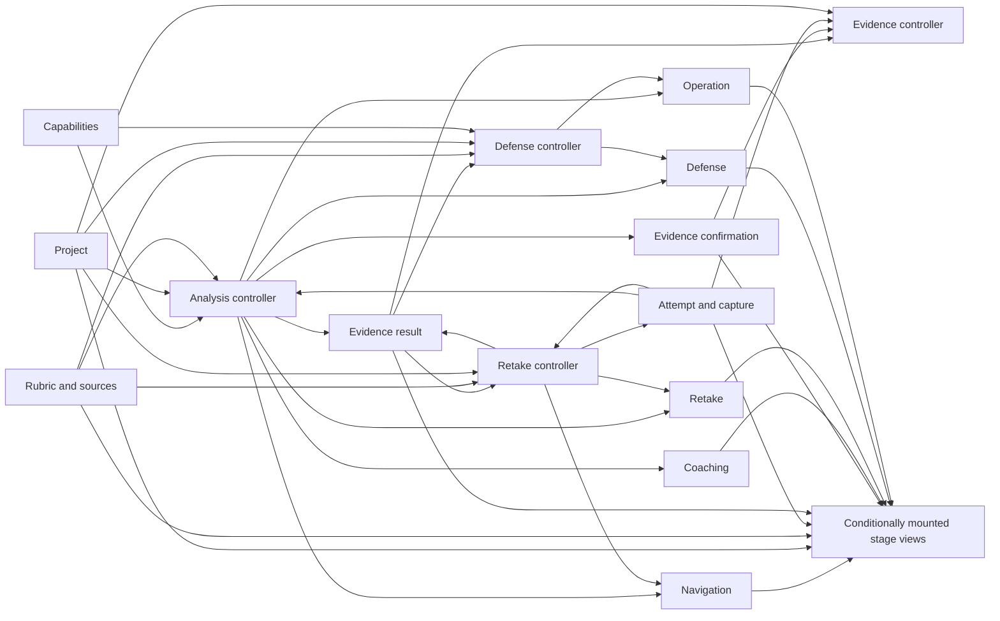

# Practice-room state graph — 20 August 2026

> Implementation design for issue #39. This is a behaviour-preserving refactor of
> `apps/web/components/practice-room.tsx`; it does not add a product capability, change an API,
> change persistence, or rewrite interface copy.

## Why the seam is state, not screens

`practice-room.tsx` is currently 1,976 lines. The approved audit found 55 `useState` hooks,
22 top-level named handlers, and five conditionally mounted render blocks: setup, interview
attempt, presentation attempt, review, and defense. The transcript-limit preparation then added
`retakeError`, so the implementation baseline is now **56 state hooks**. That addition belongs
to the already identified retake domain; it does not create another seam.

Splitting at the five render blocks would only move shared state into long prop lists.
`analysis`, `rubricCriteria`, `selectedProjectId`, `projectLanguage`, and `remoteContext` cross
several blocks. The stable seams are the domains that own transitions and reset together.

This design therefore uses small domain hooks with explicit `{ state, actions }` results and
narrow controller inputs. It does **not** use a room-wide context, a single object holding the
whole room, or one reducer containing all 56 fields. Those approaches hide or relocate the
coupling instead of removing it.

## State ownership

The first 55 entries below are the audited baseline. The final `retakeError` entry is the
preparatory safety addition already characterized before this split.

| Owner | Count | State |
|---|---:|---|
| Navigation | 1 | `stage` |
| Capabilities | 6 | `persistence`, `sourceDocumentsAvailable`, `statelessSemanticAvailable`, `semanticDefenseAvailable`, `semanticCoachAvailable`, `recordingsAvailable` |
| Project | 8 | `remoteContext`, `selectedProjectId`, `projectTitle`, `projectLanguage`, `projectLanguageBusy`, `projectLanguageNote`, `projectLoading`, `projectLoadError` |
| Rubric and sources | 7 | `sourceDocuments`, `sourceFile`, `sourceBusy`, `sourceStatus`, `rubricCriteria`, `rubricText`, `rubricSourceType` |
| Attempt and capture | 12 | `transcript`, `duration`, `targetMinutes`, `studioBusy`, `captureMode`, `multimodalResult`, `recordingStatus`, `presentationCaptureActive`, `observationNote`, `rehearsalFormat`, `interviewTurns`, `interviewHardestQuestion` |
| Evidence result | 7 | `analysis`, `remoteAttemptId`, `engineNote`, `criterionEngines`, `reusedCitations`, `reviewId`, `questionSourceFilename` |
| Evidence confirmation | 3 | `confirmations`, `confirmationBusy`, `confirmationNotes` |
| Coaching | 3 | `coachings`, `coachBusy`, `coachNote` |
| Criterion retake | 4 | `retakeCriterion`, `retakeDraft`, `retakeBusy`, `retakeError` |
| Defense | 3 | `answer`, `defense`, `defenseEngineNote` |
| Shared operation | 2 | `error`, `busy` |
| **Current total** | **56** | **55 audited fields + one retake safety field** |

Evidence result and evidence confirmation deliberately remain separate. A re-judged verdict
can replace evidence while the user's confirmation label and its per-criterion request state
follow a different lifecycle. Combining them would make a result refresh capable of silently
discarding human labels.

Each hook exports a named state type and a named actions type:

```ts
type RetakeState = Readonly<{
  criterion: { criterionId: string; label: string } | null;
  draft: string;
  busy: boolean;
  error: 'transcript_too_long' | null;
}>;

type RetakeActions = Readonly<{
  begin(entry: { criterionId: string; label: string }): void;
  updateDraft(value: string): void;
  cancel(): void;
}>;

function useRetakeState(): Readonly<{
  state: RetakeState;
  actions: RetakeActions;
}>;
```

Callers receive only the domains they consume. Raw setters do not cross a domain boundary.
Small atomic updates may use a reducer inside one domain if that becomes clearer, but a
room-wide reducer is explicitly out of scope.

## Handler ownership

The 22 top-level handlers move as follows. Inline JSX callbacks become actions on the same
owner; they do not create another controller layer.

| Owner | Count | Existing handlers |
|---|---:|---|
| Navigation | 5 | `applyPracticeStage`, `writePracticeStage`, `openPracticeStage`, `replacePracticeStage`, `backToPracticeStage` |
| Project | 3 | `chooseProject`, `changeProjectLanguage`, `ensureRemoteContext` |
| Rubric and sources | 2 | `uploadSourceDocument`, `deleteSourceDocument` |
| Cross-stage transition | 1 | `goToSetup` |
| Analysis | 3 | `syncMultimodalAttempt`, `runAnalysis`, `completeInterview` |
| Evidence | 2 | `applyRejudgedCriterion`, `confirmEvidence` |
| Coaching | 2 | `coachInterviewAnswers`, `runCoach` |
| Criterion retake | 2 | `beginCriterionRetake`, `appendRetakeAddition` |
| Defense | 1 | `runDefense` |
| Save | 1 | `saveSession` |
| **Total** | **22** | |

Controllers coordinate domains but do not own duplicate state. For example,
`useAnalysisController` reads capability, project, rubric, and attempt state, then writes the
evidence, confirmation, coaching, retake, defense, operation, and navigation actions required
by the existing transition. This dependency remains explicit at its call site.



## Reset and retention contract

This matrix records current behaviour. The refactor must preserve it, including behaviour that
might deserve a later product change. Such a change gets its own test and commit rather than
being hidden inside this move.

| Event | Replace or clear | Must remain intact |
|---|---|---|
| Initialize route/history | Restore only a bounded presentation draft into `attempt`; otherwise enter `setup`. Review, defense, and interview evidence are not deserialized. | The selected project identity in the matching history entry. |
| Browser Back/Forward | Change `stage` from the history entry. | All in-memory domain state; popstate does not re-run analysis. |
| Choose another project | Set the selected id, loading state, clear project-load/language notes, then navigate. The workspace loader owns the replacement. | Do not invent an eager room-wide reset before route recovery. |
| Return to setup | Clear shared error and retake target/draft/error. | Draft, rubric, analysis, confirmations, coaching, and defense remain in memory. |
| Change a local project's language | Replace starter draft/default rubric only when still byte-equal to the old language's starter; otherwise preserve user edits. | User-authored transcript and rubric content. |
| Start a fresh presentation analysis | Clear remote attempt id, reused citations, confirmation values/notes, defense result/note, coaching result/note, retake target/draft/error, and source filename; create a review id. | Transcript, duration, project, rubric, capture result, and capability state. |
| Complete an interview | Replace transcript, duration, capture, turns, hardest question, evidence result/provenance, and review id; clear confirmation values/notes, defense, coaching, and retake state. | Project, rubric, capability, and source-document state. |
| Edit the presentation transcript after capture | Detach `multimodalResult` and state why in `observationNote`. | The edited transcript and all project/rubric settings. |
| Begin a criterion retake | Set target, clear retake error, select writing, return to `attempt`, and set the observation note. | Original transcript, capture, and every existing verdict until an addition is accepted. |
| Retake exceeds 12,000-character limit | Set `retakeError`. | Original transcript and capture, retake draft, all verdicts, and zero rejudge requests. |
| Accept a valid retake | Append a labelled passage, detach the old capture, clear target/draft/error, and rejudge only the target; return to review after success. | Every non-target criterion verdict and its cited span. Do not add broader invalidation policy in this refactor. |
| Run defense | Replace defense result/provenance and shared operation status. | Evidence and the answer text. |
| Save | Write the same bounded per-project local summary and navigate to progress. | No state reset is required before navigation. |

## History and mount traps

The stage views must remain conditional branches. Rendering all five and hiding four would keep
child effects and media resources mounted, changing consent and capture behaviour. Preserve
these details exactly:

- setup, interview attempt, presentation attempt, review, and defense remain conditionally
  mounted in their current cases;
- interview mode still omits `defend` from the visible step order;
- `roomRef` remains on the room shell, and each transition still scrolls to the top and focuses
  that stage's `[data-stage-heading]` on the next animation frame;
- `activeStageRef`, `previousStageRef`, and `stageHistoryReadyRef` retain their jobs; a state
  closure must not replace the active-stage ref used by browser history;
- the initial history effect keeps its intentional one-time lifecycle, and the attempt-history
  effect keeps the exact `rehearsalFormat`, `selectedProjectId`, `stage`, and `transcript`
  dependencies;
- do not add a `key={initialProjectId}` remount. Project recovery remains owned by the existing
  route/loader effect;
- only a presentation attempt draft is serialized. Analysis results, interview answers, and
  defense state must not be smuggled into browser history during the move.

## Target layout

Names may tighten during implementation, but ownership must not drift:

```text
apps/web/components/practice-room.tsx             orchestration and room shell
apps/web/components/practice-room/
  model.ts                                        stage/types and pure helpers
  state/use-navigation-state.ts
  state/use-capability-state.ts
  state/use-project-state.ts
  state/use-rubric-state.ts
  state/use-attempt-state.ts
  state/use-evidence-result-state.ts
  state/use-evidence-confirmation-state.ts
  state/use-coaching-state.ts
  state/use-retake-state.ts
  state/use-defense-state.ts
  state/use-operation-state.ts
  controllers/use-analysis-controller.ts
  controllers/use-evidence-controller.ts
  controllers/use-retake-controller.ts
  controllers/use-defense-controller.ts
  controllers/use-save-controller.ts
  views/setup-stage.tsx
  views/interview-attempt-stage.tsx
  views/presentation-attempt-stage.tsx
  views/review-stage.tsx
  views/defense-stage.tsx
```

`practice-room.tsx` constructs the hooks, passes explicit state/action slices to controllers
and views, and owns no second copy of their data.

## Extraction checkpoints

Each checkpoint is a reviewable, behaviour-neutral commit and returns to green before the next
one starts.

1. Freeze the criterion-retake characterization tests and add an architecture test that fails
   while any file in the practice-room cluster owns more than 15 `useState` calls.
2. Move stage types, constants, and pure helpers to `model.ts`; keep their existing unit tests
   byte-for-byte in behavioural expectations.
3. Extract navigation/history. Run the history and back-navigation browser cases before moving
   another domain.
4. Extract capability, project, and rubric/source state and actions.
5. Extract attempt/capture state. Verify that media components still mount only by explicit
   choice and unmount on stage change.
6. Extract evidence result and evidence confirmation as two independent hooks, followed by
   coaching, defense, and retake.
7. Extract the cross-domain controllers one at a time: analysis, evidence, retake, defense,
   then save. Keep each controller's dependencies explicit.
8. Move the five conditional JSX blocks into stage views. Migrate source-based tests to their
   actual owning files in the same commit.
9. Run the complete gate and review the diff for accidental copy, contract, persistence, or
   golden-baseline changes.

The done criterion is strict: **no file in the practice-room cluster may contain more than 15
`useState` calls**, no room-wide context or reducer may replace them, the frozen browser
behaviour remains unchanged, and `pnpm check` is green.

## Test migration

Five unit suites currently assume all practice markup lives in one source file. Moving their
assertions is deliberate strengthening, not weakening:

- `test/i18n.test.mjs`: read the `Stage` union from `model.ts`, scan every file in the cluster
  for message lookups, and keep both-catalogue completeness checks;
- `test/nielsen-heuristics.test.mjs`: build its practice surface from the cluster, but point
  ordering and control assertions at the stage view that owns the markup;
- `test/invariants.test.mjs`: include every new TSX file in the unsafe-HTML scan, and point the
  evidence-boundary and evidence-before-delivery assertions at `review-stage.tsx`;
- `test/multimodal-review.test.mjs`: point rubric-timeline wiring at its controller/view owner
  while preserving the same complete-rubric assertions;
- `test/design-system.test.mjs`: include all practice stage views in `INDEX`, so moving markup
  cannot make the design guard stop seeing it.

The three criterion-retake browser cases in `e2e/production-ui/multimodal.spec.ts` are frozen
before extraction:

1. a marked addition re-judges one missing criterion without changing settled evidence;
2. an over-limit addition preserves the draft, original capture, and makes no rejudge request;
3. repairing the weakest criterion retargets a stale judge question to the new weakest gap.

Their product expectations do not change during this refactor. A selector may move only if the
same accessible control and stage structure remain; any changed behaviour requires a separate
spec decision and commit.

## Validation and rollback

At every checkpoint run the affected unit tests and `pnpm typecheck`. After any history,
capture, or controller move, also build and run the focused production-browser specs against
that fresh build. Before merge, run `pnpm check`; it is the only definition of done.

Do not run `pnpm golden:capture`: analyzer behaviour is outside this refactor. The final diff
must contain no database migration, wire-contract change, message-copy rewrite, or golden
fixture update.

Because every checkpoint is green and changes no persisted representation, rollback is a
normal revert of the latest checkpoint. If a checkpoint cannot preserve the reset matrix or
history contract, revert it and narrow the extraction; do not patch the browser test around the
regression. No feature flag is needed for a refactor that lands only in independently green,
revertible steps.
